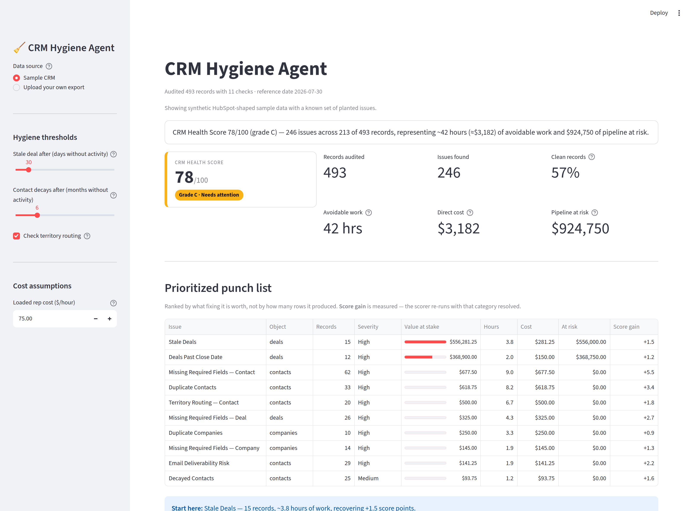

# CRM Hygiene Agent

### ▶ [**Try the live demo →**](https://crm-hygine-agent.streamlit.app/)

**Upload a HubSpot CRM export → get a CRM Health Score, a dollar-quantified estimate of what the mess is costing you, and a prioritized remediation punch list.** No paid services, runs anywhere, reproducible every time.

> Built as a RevOps engineering case study: it demonstrates domain fluency (knowing *what* good CRM hygiene is and *why* it maps to revenue), engineering (a clean, tested data pipeline), and communication (a decision-ready report, not a wall of errors).

[](https://crm-hygine-agent.streamlit.app/)

*The demo opens with sample data already loaded — it produces a full report on first click, no file needed.*

---

## The problem

Every B2B company's CRM rots over time. Reps create duplicate contacts, deals sit untouched for months, emails go stale and bounce, required fields get skipped, and leads land on the wrong owner. Nobody's job is to clean it, so it compounds silently until:

- **Forecasts lie** — stale/ghost deals inflate the pipeline number leadership plans around.
- **Reps waste hours** — chasing dead contacts and re-entering duplicates.
- **Marketing burns sender reputation** — emailing decayed/role-based contacts drives bounces and spam flags.
- **Routing leaks revenue** — a hot lead with the wrong (or no) owner just sits there.

The killer detail: most teams can't even *measure* how bad it is, so it never gets prioritized. This tool turns invisible data debt into a number an ops leader can act on.

## What it checks

| Check | Flags | Revenue consequence |
|---|---|---|
| **Duplicates** | Same contact/company via email, domain, or fuzzy name match | Wasted rep effort, split activity history |
| **Decayed contacts** | Role-based emails, likely-invalid addresses, no activity in N months | Sender-reputation risk, dead outreach |
| **Missing fields** | Blank required fields (email, owner, lifecycle, country…) | Broken routing, un-scorable leads |
| **Bad routing** | Owner missing, or territory ≠ assigned owner's region | Leads rotting unassigned, SLA breaches |
| **Stale deals** | Open deals past age / close date with no activity | Inflated forecast, pipeline hygiene |
| **Report** | Health score + \$ impact + prioritized punch list | Makes all of the above actionable |

## The output

```
CRM Health Score 78/100 (grade C) — 246 issues across 213 of 493 records,
representing ~42 hours (≈$3,182) of avoidable work and $924,750 of pipeline at risk.

#  Issue                              Recs     Sev   Hours       Cost     At risk  +Score
1  Stale Deals                          15    High     3.8       $281    $556,000     1.5
2  Deals Past Close Date                12    High     2.0       $150    $368,750     1.2
3  Missing Required Fields — Contact    62    High     9.0       $678          $0     5.5
4  Duplicate Contacts                   33    High     8.2       $619          $0     3.4
5  Territory Routing — Contact          20    High     6.7       $500          $0     1.8
```

The punch list is ranked by **what fixing it is worth**, not by row count — so a small, expensive category outranks a large cosmetic one. The `+Score` column is *measured*, not estimated: the scorer re-runs with that category removed and takes the difference, which matters because per-record penalty capping makes the relationship non-linear. That turns the report from a complaint into a plan: *"merge these 33 duplicates, recover 3.4 points and 8 hours."*

## How the numbers are built

A single figure a sharp CRO can poke a hole in discredits the whole report, so the model follows three rules:

**1. Two numbers, two methods, never mixed.**
- *Direct cost* — every finding carries an estimate of the minutes to remediate it, priced at a loaded hourly rate. One consistent unit, additive, easy to defend.
- *At-risk pipeline* — deal value × a risk factor, labelled **at risk**, never "lost."

**2. Risk-adjusted, never face value.** A 90-day-silent $150k deal is not a $150k loss. Exposure is banded by neglect (30d → 25%, 60d → 50%, 90d+ → 75%) and **capped below 100%**, because even a badly neglected deal isn't certainly dead.

**3. Additive by construction.** A deal that is both stale *and* past its close date has one exposure, not two. The at-risk amount is attributed to the single worst finding and zeroed on the others, so summing any subset of findings is always correct.

Every assumption lives in `ImpactAssumptions` and is printed with the report, so a reader who disagrees with a number can change it rather than disbelieving the output.

### The health score

Each record starts at full health and loses points per finding, weighted by severity, **capped at two critical issues** so a few catastrophic records can't dominate. Scores are pooled across all records, which makes the score volume-normalized — a bigger CRM isn't automatically a worse one.

## Architecture

The rule **engine knows nothing about the web app**. It takes DataFrames in and returns structured findings out, so the same engine can be driven by the web app, a CLI, or a test suite with zero changes.

```
crm-hygiene-agent/
├── app.py                 # Streamlit UI (thin — collect inputs, call engine, render)
├── engine/                # the brain (pure Python, no UI deps)
│   ├── loader.py          # read + normalize HubSpot CSV schema
│   ├── models.py          # Finding / Check / Severity types
│   ├── scoring.py         # health score (0–100) + $ impact model
│   ├── report.py          # findings → structured report
│   └── checks/            # one file per check, all sharing one contract
├── data/
│   ├── generate_sample.py # synthetic HubSpot-shaped data w/ planted issues
│   └── samples/           # ready-to-audit demo CSVs + ground-truth manifest
└── tests/                 # each check proven against the ground truth
```

## Quick start

```bash
pip install -r requirements.txt
streamlit run app.py
```

The app opens with the sample CRM already loaded, so it produces a full report on first click — no file hunting required. Switch the sidebar to **Upload your own export** to audit real HubSpot CSVs (Contacts, Companies, Deals — any subset works).

Every threshold and cost assumption is a sidebar control, so you can retune the policy to your own motion and watch the score and the punch list move.

```bash
# optional: regenerate the sample data — needs no dependencies
python data/generate_sample.py
```

Tested on Python 3.11 with the versions pinned in `requirements.txt`.

## Deploying

The app runs free on [Streamlit Community Cloud](https://share.streamlit.io):

| Field | Value |
|---|---|
| Repository | `mareopuzo/project` |
| Branch | `main` |
| **Main file path** | **`app.py`** |
| Python version | 3.11 (under *Advanced settings*) |

The deploy form defaults the main file to `streamlit_app.py` — that's a placeholder, not this repo's entry point. Set it to `app.py`.

If the branch dropdown claims a branch doesn't exist, reload the page: the branch list is fetched once when the form opens, so it goes stale after a push.

### The sample data

`data/generate_sample.py` builds three CSVs shaped like a real HubSpot export (Contacts, Companies, Deals) with a **controlled set of planted hygiene issues**, plus a `ground_truth.json` manifest listing every issue by record ID. That manifest is the oracle the test suite checks the engine against — so we can prove the agent catches what's actually wrong without over-flagging clean records.

It's **deterministic** (seeded), so the demo and tests are reproducible:

```bash
python data/generate_sample.py --seed 42 --contacts 250 --companies 80 --deals 120
```

The manifest is *exact*, not approximate — two properties make it so. Base records are clean by construction (emails and domains are de-duplicated as they're generated, so random name collisions can't create accidental duplicates), and a `Planter` tracks which columns of which records are already spoken for, so no plant can silently clobber an earlier one. That's what lets the tests assert **set equality** between what each check flags and what was planted — proving no false negatives *and* no false positives at once, rather than "it found most of them."

## Testing

```bash
python -m pytest -q      # 55 tests
```

Every check is verified against the ground-truth manifest, plus hand-built edge cases: threshold boundaries, legitimate-but-unusual TLDs (`.co` is one edit from `.com` and must not be flagged), blank-vs-wrong distinctions, and a guarantee that no check mutates its input.

**No double-counting.** Each check owns exactly one failure mode. A blank owner is reported once by the missing-fields policy — the routing check deliberately skips unowned records rather than flagging them again, so one underlying problem never inflates the score twice.

## Build status

- [x] **Step 1 — Sample data generator** (HubSpot-shaped CSVs + ground-truth manifest)
- [x] **Step 2 — Loader + core models** (`Finding`, `Check` contract, `Config`, HubSpot schema normalization; 8 tests)
- [x] **Step 3 — All 11 checks** (duplicates, missing fields, decay, routing, stale deals; 55 tests)
- [x] **Step 4 — Scoring + \$ impact model + report** (health score, risk-adjusted exposure, ranked punch list; 84 tests)
- [x] **Step 5 — Streamlit app** (upload or sample, live-tunable policy, filterable findings, CSV/JSON export; 92 tests)
- [x] **Step 6 — Deployed** — [live at crm-hygine-agent.streamlit.app](https://crm-hygine-agent.streamlit.app/)
